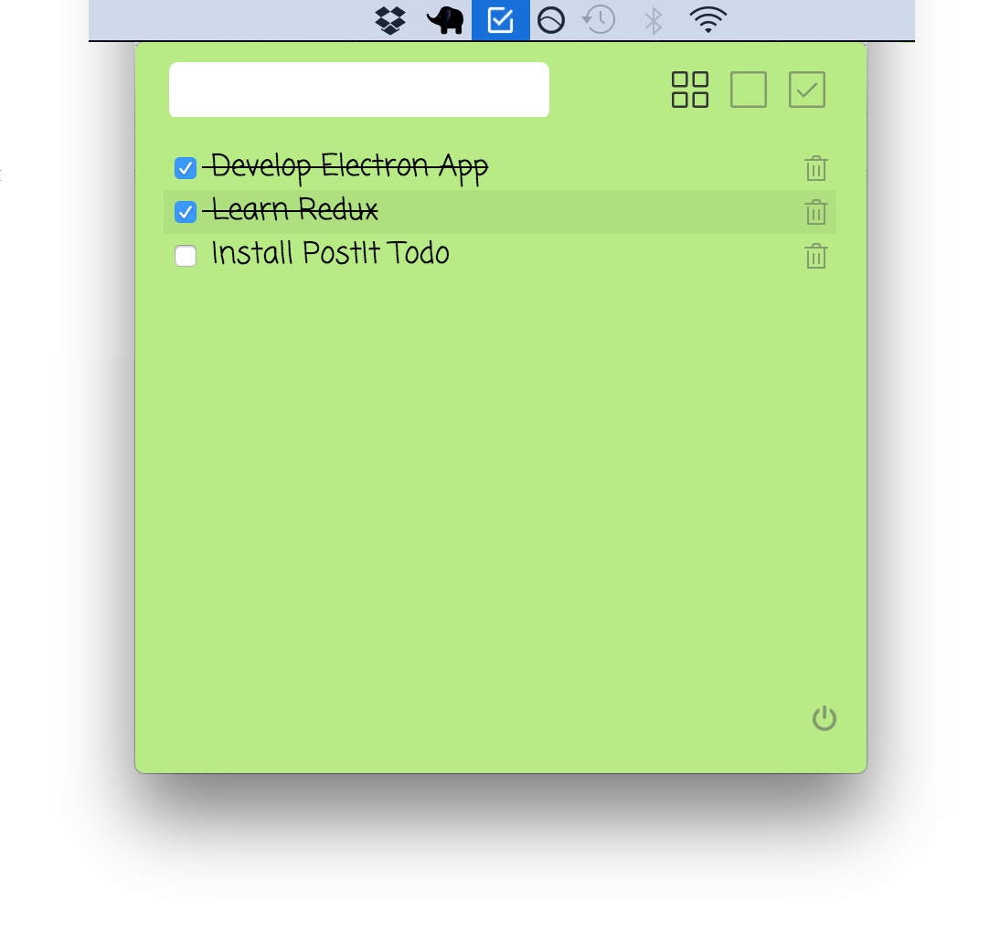

# PostIt-Todo

PostIt Todo is a todo task list manager app for OSX menubar.

This is implemented using **Electron, Redux, React, idb (IndexedDB)** along with **Babel & Webpack.**

Download the latest `.dmg` file for mac [here](https://github.com/Praseetha-KR/postit-todo/tree/master/dist/mac)





###Install dependencies:

```
npm install
```

###Start development server & app:

```
npm run dev
npm start
```

###Distribution:

```
npm run dist
```
